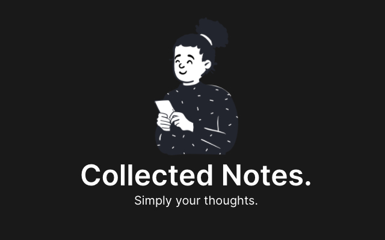

# Collected Notes Chrome Extension (alpha)

> A Chrome extension to create new notes with just one click.

### Installation Instructions

1. Download this repo as a [ZIP file](https://github.com/pazguille/collected-notes-extension/archive/master.zip).
2. Unzip the file and you should have a folder named `collected-notes-extension-master`.
3. In Chrome go to [the extensions page](chrome://extensions) (`chrome://extensions`).
4. Enable `Developer Mode` checkbox.
5. Drag the `collected-notes-extension-master` folder anywhere on the page to import it. Do not delete the folder afterwards.

**NOTE: You must be logged in, otherwise you will be redirect to the login page.**

## With ❤ by

- Guille Paz (Front End Web Developer & Web Standards lover)
- E-mail: [guille87paz@gmail.com](mailto:guille87paz@gmail.com)
- Twitter: [@pazguille](https://twitter.com/pazguille)
- Web: [https://pazguille.me](https://pazguille.me)

## License

Copyright © 2020.
